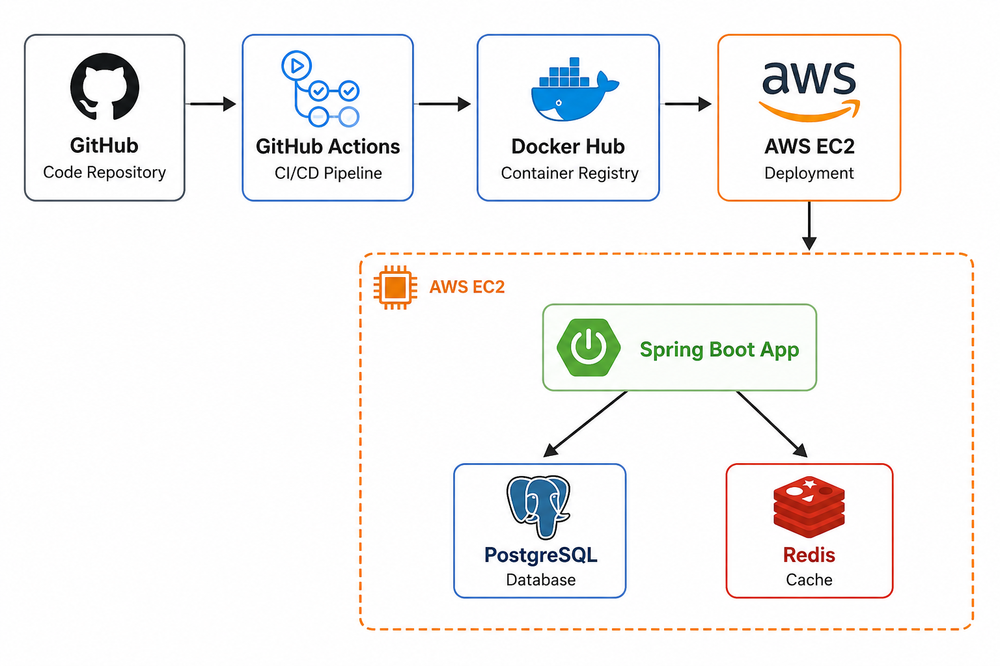

# Movie Booking System

## Tech Stack
Spring Boot | PostgreSQL | Redis | Docker | AWS EC2 | GitHub Actions

## Architecture Diagram

## Features
- Movie management
- Seat booking
- Redis caching for seat locking

## CI/CD Pipeline
- Auto builds on every push to main
- Pushes Docker image to Docker Hub
- Auto deploys to AWS EC2

## API Documentation
## MovieController
**Base Path:** `/api/movies`

| Method | Endpoint |
|--------|----------|
| GET | `/api/movies` |
| GET | `/api/movies/{id}` |
| POST | `/api/movies` |
| PUT | `/api/movies/{id}` |
| DELETE | `/api/movies/{id}` |
| GET | `/api/movies/search` |
| GET | `/api/movies/genre` |
| GET | `/api/movies/language` |

---

## CityController
**Base Path:** `/api/cities`

| Method | Endpoint |
|--------|----------|
| GET | `/api/cities` |
| GET | `/api/cities/{id}` |
| POST | `/api/cities` |
| DELETE | `/api/cities/{id}` |

---

## CinemaController
**Base Path:** `/api/cinemas`

| Method | Endpoint |
|--------|----------|
| GET | `/api/cinemas` |
| GET | `/api/cinemas/city/{cityId}` |
| GET | `/api/cinemas/{id}` |
| POST | `/api/cinemas/city/{cityId}` |
| DELETE | `/api/cinemas/{id}` |

---

## ScreenController
**Base Path:** `/api/screens`

| Method | Endpoint |
|--------|----------|
| GET | `/api/screens/cinema/{cinemaId}` |
| GET | `/api/screens/{id}` |
| POST | `/api/screens/cinema/{cinemaId}` |
| DELETE | `/api/screens/{id}` |

---

## ShowtimeController
**Base Path:** `/api/showtimes`

| Method | Endpoint |
|--------|----------|
| POST | `/api/showtimes/movie/{movieId}/screen/{screenId}` |
| GET | `/api/showtimes` |
| GET | `/api/showtimes/{id}` |
| DELETE | `/api/showtimes/{id}` |

## How to Run Locally
(docker-compose up --build)

## Live URL
http://100.30.239.142:3000

